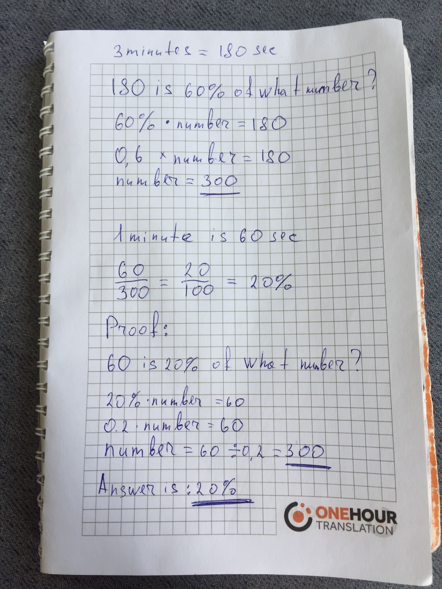

# Linkalong python assessment

## Answers on small technical task

* brick weighs 1 kg plus half the weight of the brick - how much does the brick weigh?
    * The answer is 1 kg
    
* In an array of any size with integers from 1 to 500,000, one number is repeated twice, all other numbers are unique. Suggest the fastest algorithm for finding a recurring number.
    * The answer is in `python3 find_the_duplicate_number.py`

* Write a console program that will bypass the matrix with a snail starting from the top left corner. At the input, parameter 2, the dimension of the matrix IxJ, at the output list of current coordinates for each visited point.
    * The answer is in `python3 spiral_matrix.py 3x3`

* Looking at the sky for three minutes, the probability of noticing the aircraft is 60%. Determine the probability of noticing the aircraft in one minute and explain the solution.
    * The answer is 20% (explanation is in attached image)

* Write a console program which by a given number finds the binary number inverse to it (13 => 1101, inverse to it (read from right to left) 1011 => 11). At the input parameter number N 1 <= N <= 1000000000, the output is a return number.
    * The answer is in `python3 reverse_bits.py 13`

## Questionnaire

- З чим пов'язане розгляд пропозиції?
    - Цікаві нові проекти
- Чому міняли проекти раніше (три останніх)?
    - Давно вже не змінював (десь 7 років)
- Як швидко готові приступити, якщо приймете оффер?
    - 1 місяць 
- Де на практиці доводилось використовувати англійську?
    - Англійська advanced level, використовую кожен день
- Побажання по ЗП.
    - Написав у приват

Проставьте бали своїм навичкам:

Python3 / Redis / RabbitMQ / JS / React, виходячи з того, що:

1 - не знаю

2 - знаю в теорії

3 - знаю, як працює, вмію використовувати, але мало практики

4 - знаю, як працює, вмію використовувати, впевнено використовую

5 - глибоке розуміння і відмінні навички роботи з технологією, багато практики

| Technology | Grade |
| :---: | :---: |
| Python3 | 4 |
| Redis | 4 |
| RabbitMQ | 5 |
| JS | 4 |
| React | 3 |

### Looking at the sky task explanation:

### Max Belushkin's CS
